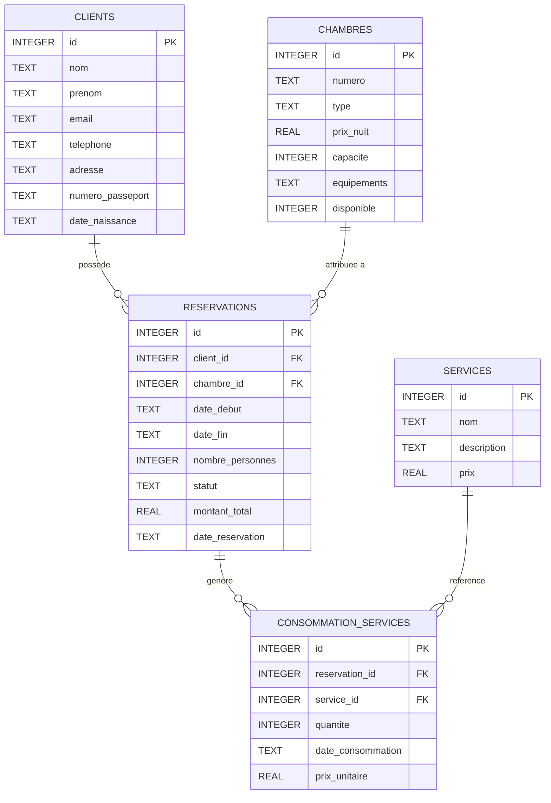

# Diagramme simple des tables SQLite

## Vue relationnelle

## Lecture rapide

- Un client peut avoir plusieurs reservations.
- Une chambre peut etre utilisee dans plusieurs reservations, a des dates differentes.
- Une reservation peut contenir plusieurs consommations de services.
- Une consommation relie une reservation a un service avec quantite et prix unitaire.
